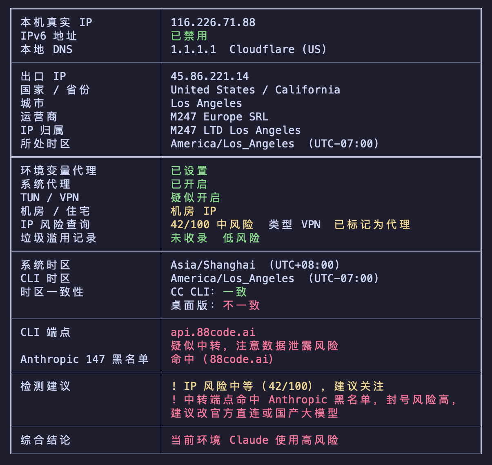

# Claude-IPCheck Toolkit

> 一键检测「当前 Windows 网络环境是否适合稳定、低风控地使用 Claude AI」。

本工具面向普通 Windows 用户，无需改注册表、不修改默认浏览器、不需要管理员权限。
它把两套检测合在一起，互相印证：

| 检测层 | 工具 | 看什么 |
| --- | --- | --- |
| **结构化交叉验证**（默认开） | [ip-api.com](http://ip-api.com/json) 免费 JSON API | 出口 IP 的国家/地区、ISP、ASN、组织，并判断是否为「机房/数据中心 IP」（Claude 风控高风险项） |
| **Claude 专项检测**（核心） | [stormzhang/ipcheck](https://github.com/stormzhang/ipcheck)（`ai-ipcheck`） | IP 属地、DNS 泄漏、代理、时区、Claude 端点可达性、数据中心风险 → 给出 **低 / 中 / 高** 风险综合结论 + 评分 |

> 为什么不用 `ipinfo.cv/claude-ai-check` 做自动判定？
> 该页面是纯前端 JavaScript 渲染，脚本抓取不到结论（只拿到一个 5 KB 的空壳）。
> 因此脚本用**结构化 JSON API** 做自动化交叉验证，同时**可选**在浏览器里打开 ipinfo.cv 让你**人工**肉眼核对。

---

## 一、准备工作（只需一次）

1. 安装 **Python 3.10 或以上**，安装时务必勾选 **`Add python.exe to PATH`**。
   下载：<https://www.python.org/downloads/>
2. 把本仓库整个文件夹下载 / 克隆到任意位置（例如桌面 `Claude-IPCheck-Toolkit`）。

> 首次运行会自动执行 `python -m pip install ai-ipcheck`，需联网。

---

## 二、傻瓜式使用

### 方式 A：双击运行（推荐）
直接双击 **`Start-ClaudeIpCheck.bat`**，等待结果即可。

### 方式 B：持续监测（适合挂 VPN 后自动检测）
双击 **`Start-ClaudeIpCheck-Monitor.bat`**：脚本每 15 秒看一次出口 IP，
等 IP 稳定后自动跑一次完整检测。`Ctrl+C` 退出。

---

## 三、命令行参数

在 `ClaudeIpCheck.ps1` 后追加参数即可，例如：
`powershell -File ClaudeIpCheck.ps1 -Monitor -OpenIpInfoCv`

| 参数 | 说明 | 默认 |
| --- | --- | --- |
| `-Once` | 只检测一次就退出（默认行为） | 开 |
| `-Monitor` | 持续监测出口 IP 变化，稳定后自动检测 | 关 |
| `-Region <Overseas\|China\|Any>` | 目标区域建议文案 | `Overseas` |
| `-StablePolls <int>` | Monitor 模式：IP 连续稳定几次后触发 | `2` |
| `-PollIntervalSec <int>` | Monitor 模式轮询间隔（秒） | `15` |
| `-NoCrossCheck` | 关闭结构化 JSON IP 交叉验证 | 关（即开启） |
| `-OpenIpInfoCv` | 检测后打开 ipinfo.cv 供人工核对 | 关 |
| `-SkipInstall` | 跳过自动安装 ai-ipcheck（已装好时用） | 关 |
| `-TimeSync` | 开启时钟同步（w32tm /resync，通常需管理员） | 关 |

---

## 四、结果怎么看

### 风险等级速查

| 等级 | 含义 | 建议 |
| --- | --- | --- |
| **低风险（绿）** | 环境干净，各项通过 | 可以稳定使用 Claude |
| **中风险（黄）** | 可用但需注意 | 建议开全局 TUN、关 WebRTC 本地 IP 泄漏、用清洁 DNS（如 1.1.1.1）、避免多人共用同一 IP |
| **高风险（红）** | 多项不通过 | 不建议直接用于 Claude，易被风控/封号；优先更换为家庭/住宅 IP 或合规代理 |

### 实际运行效果示例

下面是脚本在 Windows 终端中的实际输出样例（`stormzhang/ipcheck` 的完整检测结果 + 结构化交叉验证）：



从图中可以看到，脚本会依次展示：

| 检测区域 | 显示内容 |
| --- | --- |
| **本机信息** | 真实 IPv4、IPv6 状态、本地 DNS |
| **出口 IP 信息** | 出口 IP、国家/省份、城市、运营商、IP 归属、所处时区 |
| **环境检测** | 环境变量代理、系统代理、TUN/VPN、机房/住宅判断、IP 风险评分、垃圾滥用记录 |
| **时区一致性** | 系统时区 vs CLI 时区是否一致（桌面版 vs CLI 版差异）|
| **端点检测** | CLI 端点可达性、Anthropic 黑名单命中状态 |
| **检测建议** | 根据各项结果给出具体改进建议 |
| **综合结论** | 最终 **低 / 中 / 高** 风险判定（红色高亮高风险）|

> 注：上图截自用户真实机器（VPN 连接后），显示为中风险 42/100——属于可用但需优化的典型场景。
> 结构化交叉验证（ip-api.com）的独立判定会在 ipcheck 结果之前单独打印一行，例如：
> `[CROSS-CHECK] 出口 IP: 45.86.221.14 | 美国 / M247 Europe SRL | ⚠️ 可能是数据中心/机房 IP`

---

## 五、常见问题

**Q：提示「未找到 Python 3.10+」？**
重装 Python 并勾选 `Add to PATH`；或在安装后重启终端/电脑让 PATH 生效。

**Q：ipcheck 装不上 / 很慢？**
手动执行 `python -m pip install -U ai-ipcheck`；如网络受限可换源
`python -m pip install -U ai-ipcheck -i https://pypi.tuna.tsinghua.edu.cn/simple`。

**Q：想每次手动在浏览器里看 ipinfo.cv 的结果？**
加 `-OpenIpInfoCv` 参数（或改 bat 加上该参数）。

**Q：公司/校园网下检测不准？**
可能是出口做了 SNAT 或代理，结论仅供参考，以实际能否登录 Claude 为准。

---

## 六、目录结构

```
Claude-IPCheck-Toolkit/
├── ClaudeIpCheck.ps1              # 主脚本
├── Start-ClaudeIpCheck.bat        # 双击：单次检测
├── Start-ClaudeIpCheck-Monitor.bat# 双击：持续监测
├── screenshots/
│   └── ipcheck-output-example.png # 输出示例截图
├── README.md
├── LICENSE
└── .gitignore
```

---

## 免责声明

本工具仅用于**网络环境自检与学习**，不提供、不推荐任何绕开服务地区限制的手段。
检测结果受出口 IP、DNS、WebRTC、时区等多因素影响，仅供参考，不构成任何保证。
请遵守你所使用服务的官方条款与当地法律法规。
